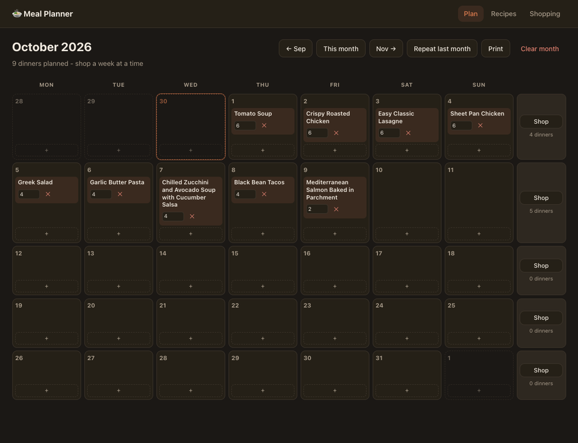
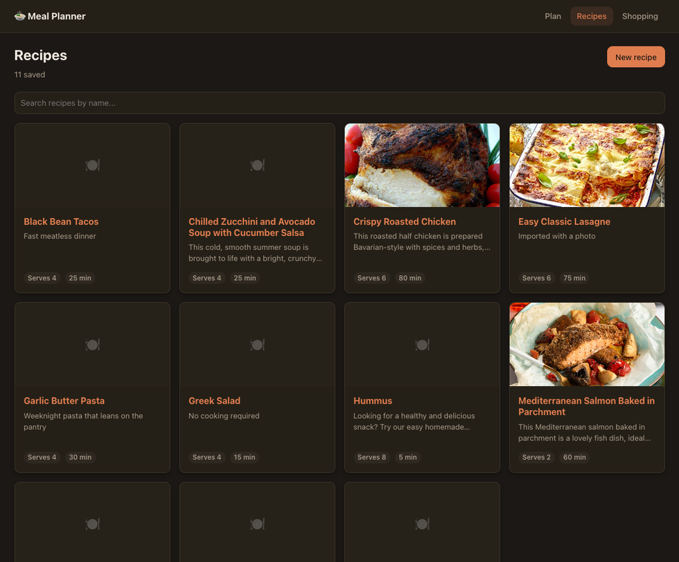
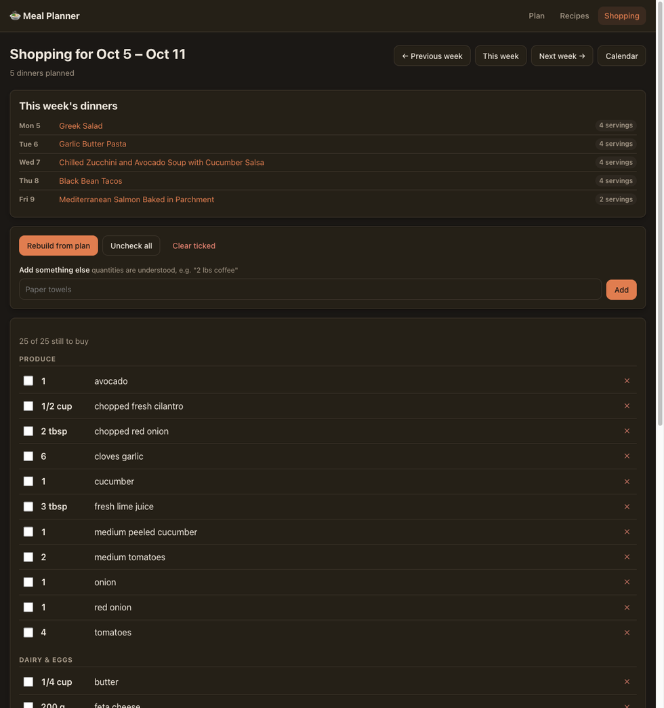

# Recipes & Menu Planner

Plan a month of family dinners on a calendar, then shop for it a week at a time
from a list that adds up the ingredients for you.

Save recipes by pasting a link — the app reads the page and fills the form in.
Plan the whole month in one sitting. Each week on the calendar has its own
**Shop** button, which turns that week's dinners into a single grocery list with
the quantities combined: `2 tbsp` here plus `1/4 cup` there becomes one line
saying `3/4 cup`.

Built to run on a machine at home. **There is no login** — anyone who can reach
the server can use it, so keep it on your own network.



---

## Getting started

### 1. What you need

- **Java 21.** The repo pins it via `.tool-versions` for [asdf](https://asdf-vm.com)
  or [mise](https://mise.jdx.dev); otherwise any JDK 21 on your `PATH` will do.
- **Docker**, to run PostgreSQL. (Or your own Postgres 16+ — see
  [Configuration](#configuration).)

Check you have them:

```bash
java -version      # should say 21
docker --version
```

### 2. Start the database

```bash
docker-compose up -d
```

That brings up PostgreSQL on **port 5433** — not the usual 5432, so it will not
collide with another Postgres already on the machine.

### 3. Start the app

```bash
./gradlew run
```

Open **http://localhost:8080**. The database schema is created automatically on
first boot, so there is no separate migrate step.

### 4. Add some recipes to look at (optional)

```bash
./scripts/seed-demo.sh
```

Six recipes, added through the app's own forms. Skip it if you would rather
start with your own.

---

## Using it

### Saving a recipe

Go to **Recipes → New recipe**, paste a link into **Source URL**, and press
**Import**. Title, description, servings, prep and cook times, ingredients,
instructions and the photo are filled in for you. Check it over, then save.

Nothing stops you typing a recipe by hand instead. Ingredients go in one per
line, in whatever way you would write them on paper:

```
2 tbsp olive oil
1 1/2 cups flour, sifted
3 cloves garlic, minced
800 g canned tomatoes
salt, to taste
```

The form shows how it understood each line as you type, so you can see straight
away if something was read wrong.

### Recipes on paper

There is nothing to import from a cookbook or a recipe card, but you do not have
to retype the ingredients either. On a Mac, photograph the page, open it in
Preview or Photos, select the ingredient list directly off the image with Live
Text, and paste it in. Printed text comes back near-perfectly, including
fractions.

The parser expects text that has been through a scanner. A mixed fraction loses
its space when read off a page — `1 1/2` comes back as `11/2`, which taken
literally is five and a half — so a numerator that is both multi-digit and no
smaller than its denominator is split back apart. Cooking fractions are always
proper, so nothing a person types looks like that. Units mangled the same way
are understood too: `Ibs` and `1bs` are read as pounds, `0z` as ounces, since
`l`, `I`, `1` and `O`, `0` are interchangeable to a scanner.

> **If a site refuses to be imported** (some answer 403 to anything that is not a
> browser), use the **bookmarklet** offered on that same form. Drag it to your
> bookmarks bar once; from then on, click it on any recipe page and the planner
> opens in a new tab ready for you to paste. See
> [When a site blocks the importer](#when-a-site-blocks-the-importer).



### Changing how many it feeds

Every recipe has one **servings** box, on its ingredients card. Change it and the
quantities on screen rescale — and that is the number used when you add the
recipe to a night.

Amounts are rewritten the way a cook would say them: a quarter cup at 1.5× reads
as `6 tbsp`, not `3/8 cup`, and countable things round up, because half an onion
is not something you can buy.

### Planning the month

**Plan** shows the month as a calendar. Press **+** on any night to search your
recipes and pick one; more than one dinner can share a night. The servings box on
each meal sets how many you are cooking for that night.

- **← Sep / Nov →** move between months.
- **Repeat last month** copies the previous month across, matching meals by
  weekday rather than by date, so a Friday pizza stays on a Friday.
- **Print** gives you a printable sheet — see [Printing](#printing).

### Shopping for a week

Each row of the calendar is a Monday-to-Sunday week with its own **Shop** button.
That opens the week's list, grouped by supermarket aisle, with every recipe's
ingredients scaled to the servings you planned and combined into one line each.

Tick things off as you go. You can add anything else you need at the bottom —
`2 lbs coffee` is understood the same way a recipe line is. **Rebuild from plan**
re-reads the calendar without losing what you have already ticked or added, so it
is safe to press mid-shop.



### Printing

**Print** on the calendar opens a printable sheet with a **Month / Week** toggle.
The month prints landscape as a grid; the week prints portrait as a row per day,
which is easier to read from across the kitchen.

Both show only the date and what is being cooked — no servings, no buttons, no
navigation — and switch to black on white so a dark screen does not empty an ink
cartridge.

---

## Configuration

Nothing needs setting to run locally. To change anything, copy `.env.example` to
`.env`, or set the variables in the environment.

| Variable                      | Default                                        | What it is |
|-------------------------------|------------------------------------------------|------------|
| `DATABASE_URL`                | `jdbc:postgresql://localhost:5433/mealplanner` | Where Postgres lives |
| `DATABASE_USER`               | `mealplanner`                                  | |
| `DATABASE_PASSWORD`           | `mealplanner`                                  | |
| `SERVER_PORT`                 | `8080`                                         | |
| `SERVER_HOST`                 | `0.0.0.0`                                      | `0.0.0.0` so other devices on your network can reach it |
| `IMAGE_DIR`                   | `data/images`                                  | Where recipe photos are kept |
| `SCRAPER_ALLOW_PRIVATE_HOSTS` | `false`                                        | See [fetching links](#a-note-on-fetching-links) |
| `POSTGRES_PORT`               | `5433`                                         | Host port for the Docker database |
| `APP_BASE_URL`                | *(unset)*                                      | See [the bookmarklet's address](#the-bookmarklets-address) |

### Running it on your home network

```bash
./gradlew buildFatJar
java -jar build/libs/meal-planner-all.jar
```

That jar is self-contained. Point it at your Postgres with the variables above,
and browse to `http://<machine>:8080` from anything on the network.

**What to back up:** the database, and whatever `IMAGE_DIR` points at.

To wipe everything and start over: `docker-compose down -v`.

---

## How it works

Worth reading if you are changing the code, or if something behaves unexpectedly.

### The stack

| Layer         | Choice                                    |
|---------------|-------------------------------------------|
| Server        | Ktor 3.6 on Netty, Kotlin 2.4, Java 21    |
| Database      | PostgreSQL 18, Flyway migrations          |
| Data access   | Exposed 1.5 DSL over HikariCP             |
| HTML          | kotlinx.html (type-safe, server-rendered) |
| Interactivity | HTMX 2 (vendored, no CDN needed)          |

The UI is server-rendered HTML. HTMX swaps fragments in place, so there is no
JavaScript build step and no client-side framework.

### Importing recipes

Nearly every recipe site publishes schema.org `Recipe` JSON-LD, which is far
steadier than scraping their HTML — the fields are named and they survive
redesigns. The parser copes with the shapes found in the wild: recipes buried in
an `@graph`, a `@type` given as an array, instructions arriving as one HTML blob
or as grouped `HowToSection` steps, and yields written as `"6 servings"`, `6` or
`["12 cookies", "12"]`.

Sites that annotate their HTML with microdata instead of publishing JSON are
read too.

A few fields — usually servings, times and the photo — get shown on the page but
left out of the structured data. Those are read from the page text and from the
`og:image` / `twitter:image` tags, and only for fields the structured data left
empty.

Some sites publish only *part* of a recipe. recipes.heart.org lists a soup's six
salsa ingredients and leaves the ten soup ingredients out of its markup
altogether, which loses half the recipe without saying so. So the page's own
lists are read as well: a list whose items mostly begin with a quantity is an
ingredient list, judged with the same parser the form uses. The page is only
trusted over the markup when it offers strictly more *and* still accounts for
everything the markup named, so a list rendered twice for printing, or an
unrelated list that happens to look measured, cannot quietly replace good data.

A page that turns out to be a roundup ("10 Zucchini Boat Recipes") is recognised
as a list rather than a recipe, and says so instead of failing blankly.

Ingredient names are normalised (lowercased, conservatively singularised) so the
same ingredient written slightly differently in two recipes still merges on the
shopping list. Unrecognised measure words stay part of the name, so "2 cloves
garlic" keeps its "cloves" rather than guessing at a unit it does not have.

### When a site blocks the importer

Some sites sit behind bot protection (Cloudflare and the like) that answers 403
to anything that is not a real browser, whatever headers are sent. Your browser
is not blocked, though, so it can do the fetching.

The **bookmarklet** on the new-recipe form copies the page to your clipboard and
opens the planner in a new tab; pasting imports it. It works by clipboard rather
than posting the page straight here, because recipe sites are https while this
app is plain http on your network, and browsers block a cross-origin form post
between the two as mixed content. Opening a tab is ordinary navigation, which is
allowed.

Failing that, the same box takes a manual paste: open the recipe, press
Ctrl/Cmd+U to view its source, select all, paste. It opens by itself whenever an
import is refused.

### The bookmarklet's address

The bookmarklet has to know where this planner lives, and it keeps whatever
address it was made with. That address is worked out from however you reached
the app, so dragging the button from `http://nas.local:8080` gives you a
bookmarklet pointing there.

The catch is `localhost`. A bookmarklet made while sitting at the machine
running the server points at `localhost`, which on your phone means the phone.
So when the planner is opened over loopback, the form says so and offers the
addresses other devices can use, host name first — a DHCP lease will eventually
hand the machine a different IP, and a bookmarklet built on the old one breaks
silently, whereas an mDNS name keeps working.

Behind a reverse proxy or on a real host name, set `APP_BASE_URL` — it wins over
whatever any one person's browser used:

```bash
APP_BASE_URL=https://meals.example.com
```

### Pictures

Imported photos are copied into `IMAGE_DIR`. Where the source CDN refuses this
server but happily serves a browser, the address is kept and linked instead, so
the picture still shows; uploading your own copy makes it permanent.

The format is decided by reading the file's leading bytes rather than trusting
what the browser called it, names are generated rather than taken from the
upload, and reads only accept that generated shape — nothing a browser sends can
steer a path.

### A note on fetching links

Importing makes the server fetch a URL somebody typed, and the app has no login,
so that is the one genuinely sharp edge here. Requests are limited to http and
https, capped in size and time, and refused for loopback, link-local and LAN
addresses — including on every redirect hop, since a public URL is free to
redirect somewhere private. Set `SCRAPER_ALLOW_PRIVATE_HOSTS=true` only if you
actually want to import from a machine on your own network.

### The calendar

One plan per month, laid out as whole Monday-to-Sunday rows. The first and last
rows spill into the neighbouring months so every row is a full, shoppable week.

Only dinners are planned. There are no breakfast or lunch slots — adding them
back would mean a new migration and a second row of chips per day.

### The shopping list

Every planned dinner's ingredients are scaled by
`planned servings ÷ recipe servings`, then merged per ingredient:

- **Units convert within a family.** `2 tbsp` + `1/4 cup` + `2 tbsp` of olive oil
  across three recipes becomes one line.
- **Families never mix.** A cup of flour and 120 g of flour stay on separate
  lines — merging them would mean inventing a density.
- **Totals are written the way a cook would.** 12 tablespoons reads as `3/4 cup`,
  not `12 tbsp` or `177.44 ml`. Sums snap to fractions you can actually measure.
- **Metric stays metric.** If most of an ingredient's volume came from metric
  measures, the total is written in metric.
- **"To taste" stays numberless** rather than being counted.

Items are grouped by supermarket aisle using a keyword guess on the ingredient
name. It is best-effort and sometimes wrong; `OTHER` is a fine answer.

---

## Development

```bash
./gradlew test     # 100 tests, no database or network needed
./gradlew build    # compile, test, assemble
./gradlew run      # run it
```

The suite covers the parts that are easy to get subtly wrong: ingredient parsing,
unit conversion and fraction formatting, shopping list aggregation, the calendar
date arithmetic, recipe import — including the messy JSON-LD shapes real sites
emit — and the checks that stop the importer fetching LAN addresses or an upload
steering a file path.

### Project layout

```
src/main/kotlin/com/family/mealplanner/
  domain/       Quantity & units, ingredient parsing, recipes, calendar, lists
  db/           Exposed table definitions, Hikari + Flyway bootstrap
  repository/   All SQL lives here
  service/      Shopping list aggregation, recipe import, image storage
  web/          Routes, plus views/ for kotlinx.html templates
src/main/resources/
  db/migration/ Flyway SQL
  static/       CSS and vendored HTMX
```

### Changing the schema

Flyway owns the schema. Add a `V<n>__description.sql` migration, then update the
matching table object in `db/Tables.kt` by hand — Exposed does not generate them,
and a mismatch will fail at runtime rather than compile time.
